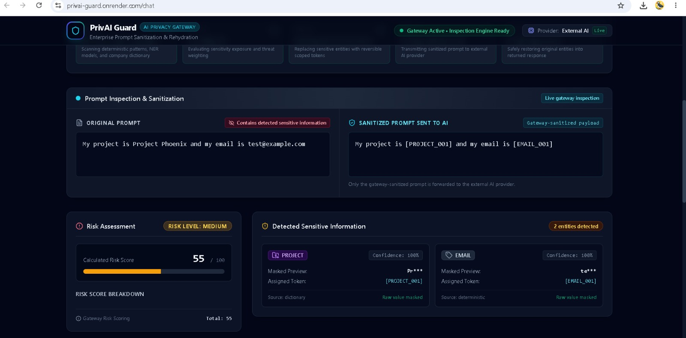
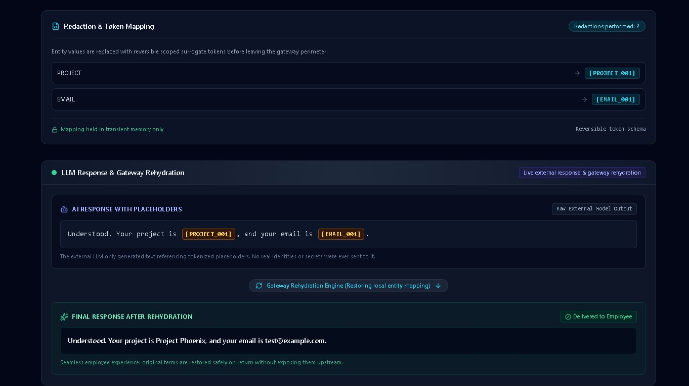
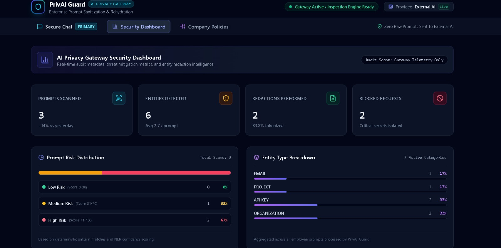
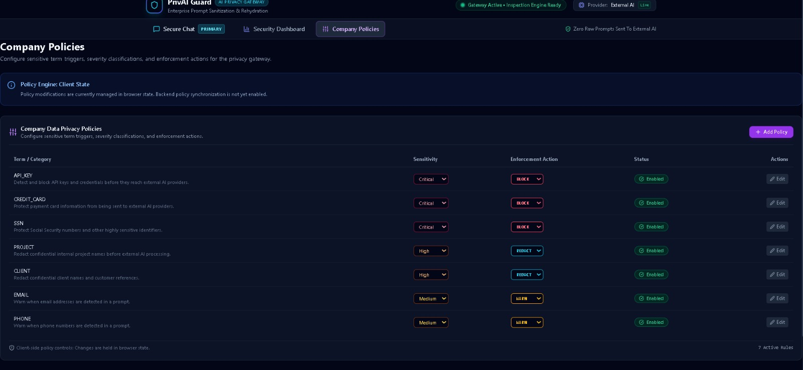

# PrivAI Guard — AI Privacy Gateway
[🌐 Live Demo](https://privai-guard.onrender.com)
> A privacy-focused middleware layer that detects sensitive information in user prompts, applies security policies, redacts protected data before external AI processing, validates the AI response, and safely rehydrates the protected information locally.

## Demo Notice

PrivAI Guard is a **working MVP/demo** and is not a production-ready enterprise security system.

The system is designed so that detected sensitive information is replaced with placeholders before the sanitized prompt is sent to the configured external AI provider.

However, sensitive-data detection is **not guaranteed to identify every possible sensitive value**. Detection depends on the implemented regular-expression rules, Microsoft Presidio/spaCy NER, and configured custom dictionary terms.

---

## Problem

Employees and users may accidentally paste sensitive information into external AI tools, including:

- API keys and credentials
- Email addresses
- Phone numbers
- Credit-card information
- Social Security numbers
- IP addresses
- Personal names
- Organization names
- Internal project names
- Client names
- Other company-specific information

Once sensitive information is sent directly to an external AI service, the organization may lose control over how that information is processed.

PrivAI Guard addresses this problem by placing a privacy gateway between the user and the external AI provider.

---

## Solution

PrivAI Guard acts as a security layer between the user and an external AI service.

Instead of sending the user's original prompt directly to the AI provider, the gateway:

1. Receives the user's prompt.
2. Detects potentially sensitive information.
3. Merges and removes overlapping detections.
4. Calculates a risk score.
5. Applies the configured security policy.
6. Allows, warns, redacts, or blocks the request.
7. Replaces detected sensitive information with placeholders.
8. Sends only the sanitized prompt to the external AI provider.
9. Validates the AI response.
10. Replaces valid placeholders with the original values locally.
11. Returns the final response to the user.

### High-Level Flow

```text
User
  |
  v
Secure Chat
  |
  v
Privacy Gateway
  |
  +--> Regex Detection
  |
  +--> Presidio / spaCy NER
  |
  +--> Custom Company Dictionary
  |
  v
Detection Merge & Deduplication
  |
  v
Risk Scoring
  |
  v
Policy Engine
  |
  +--> ALLOW
  |
  +--> WARN
  |
  +--> REDACT
  |
  +--> BLOCK
  |
  v
Redaction
  |
  v
Sanitized Prompt
  |
  v
External AI Provider
  |
  v
Placeholder Response
  |
  v
Response Validation
  |
  v
Local Rehydration
  |
  v
Final Response
````

---

## How It Works

### 1. Prompt Input

The user enters a normal natural-language prompt through the Secure Chat interface.

Example:

```text
My project is Project Phoenix and my email is test@example.com.
```

---

### 2. Sensitive Information Detection

The gateway scans the prompt using multiple detection layers.

#### Regex Detection

Deterministic regular-expression rules are used for structured information such as:

* Email addresses
* API keys
* Credit-card numbers
* Social Security numbers
* Phone numbers
* IP addresses

#### Presidio / spaCy NER

Microsoft Presidio with spaCy is used for contextual entity detection such as:

* Person names
* Organizations
* Locations
* Dates and times

#### Custom Company Dictionary

The system also supports predefined company-specific terms and phrases.

The demo includes example terms such as:

```text
Project Phoenix
Client Orion
Acme Internal
```

These terms are configurable within the detection implementation.

---

## Important Detection Limitation

The custom dictionary uses **predefined terms and phrases**.

For example, if the dictionary contains:

```text
Client Orion
```

that does **not automatically mean** that every occurrence of:

```text
Orion
```

will be detected by the dictionary detector.

Similarly, natural-language variations that do not match configured dictionary phrases may not be detected by that detection layer.

Presidio/spaCy may detect some variations depending on context, but its detection is also not guaranteed.

Therefore, the project should not be considered a perfect or complete sensitive-data detection system.

---

## 3. Detection Merging and Deduplication

Multiple detection engines may identify the same or overlapping text.

PrivAI Guard merges these detections into a canonical set of spans.

The merge logic uses deterministic rules based on:

* Confidence
* Detection span length
* Detection source priority

This prevents the same sensitive value from being unnecessarily processed multiple times.

---

## 4. Risk Scoring

Each detected entity type has an associated risk weight.

Examples include:

| Entity Type   | Example Risk Weight |
| ------------- | ------------------: |
| API_KEY       |                  90 |
| PASSWORD      |                  90 |
| SSN           |                  85 |
| CREDIT_CARD   |                  85 |
| CLIENT        |                  60 |
| INTERNAL_TERM |                  60 |
| PROJECT       |                  50 |
| PHONE         |                  45 |
| EMAIL         |                  40 |
| IP_ADDRESS    |                  35 |
| PERSON        |                  30 |
| ORGANIZATION  |                  30 |
| LOCATION      |                  20 |
| DATE_TIME     |                  15 |

The final score is calculated from the highest-risk detected entity and additional detected entities, with the score capped at 100.

Risk levels are:

* `NONE`
* `LOW`
* `MEDIUM`
* `HIGH`

---

## 5. Policy Engine

The policy engine determines what should happen to the request.

The current implementation includes rules such as:

* API keys → `BLOCK`
* SSNs → `BLOCK`
* Credit-card information → `BLOCK`
* Passwords → `BLOCK`
* Project names → `REDACT`
* Client names → `REDACT`
* Internal terms → `REDACT`
* Email addresses → `WARN`
* Phone numbers → `WARN`
* Person names → `WARN`
* Organizations → `WARN`
* Locations → `WARN`
* IP addresses → `WARN`

High-risk requests can also be escalated to stronger actions according to the implemented policy logic.

---

## 6. Redaction

When a request is allowed to proceed with redaction, detected values are replaced with placeholders.

Example:

```text
Original:

My project is Project Phoenix and my email is test@example.com.
```

becomes:

```text
Sanitized:

My project is [PROJECT_001] and my email is [EMAIL_001].
```

The gateway maintains a request-specific private mapping:

```text
[PROJECT_001] -> Project Phoenix
[EMAIL_001]  -> test@example.com
```

The original sensitive values are not included in the sanitized prompt sent to the external AI provider.

---

## 7. External AI Processing

The current MVP uses an OpenAI provider implementation behind a common `LLMProvider` abstraction.

The AI provider receives the **sanitized prompt**, not the user's original prompt.

The gateway also provides explicit instructions to the external model to:

* Treat placeholders as protected data.
* Preserve placeholder text exactly.
* Avoid guessing the original values.
* Avoid replacing placeholders with original sensitive information.
* Avoid modifying placeholder spelling or numbering.

Example sanitized prompt:

```text
Explain the architecture of [PROJECT_001] using the email
contact [EMAIL_001] as an example.
```

The external model should respond using the placeholders rather than the original values.

---

## 8. Response Validation

Before the external AI response is returned to the user, PrivAI Guard validates it.

The gateway checks for:

* Unknown placeholders
* Original sensitive values appearing in the AI response

If an invalid or unsafe response is detected, the gateway fails closed instead of silently rehydrating unsafe content.

---

## 9. Local Rehydration

Valid placeholders are replaced locally using the request-specific mapping.

Example external AI response:

```text
Your project [PROJECT_001] can use the contact
address [EMAIL_001].
```

Final response:

```text
Your project Project Phoenix can use the contact
address test@example.com.
```

This demonstrates that the external AI provider can operate on sanitized data while the gateway reconstructs the final response locally.

---

# Application Screens

The application currently contains three main screens.

## 1. Secure Chat

The primary user interface.

It shows:

* User prompt
* Detected entities
* Confidence information
* Risk score
* Risk level
* Security action
* Sanitized prompt
* External model response containing placeholders
* Final response after local rehydration

The interface also presents the processing stages:

```text
Detecting...
Scoring...
Redacting...
Sending...
Rehydrating...
```

The Secure Chat screen provides a visual demonstration of the complete privacy-gateway flow.
### Secure Chat — Sensitive Data Detection



### Secure Chat — Response Rehydration



---

## 2. Security Dashboard

The dashboard provides privacy-safe audit information such as:

* Prompts scanned
* Entities detected
* Redactions performed
* Blocked requests
* Risk distribution
* Entity-type breakdown
* Recent scan history

The dashboard does not intentionally display raw sensitive prompt contents.


---

## 3. Company Policies

The Company Policies screen provides controls for configuring policy-related information.

The current frontend policy controls are primarily managed in browser/client state.

Backend policy synchronization is **not yet enabled**.


---

# Security Design

PrivAI Guard follows several security principles.

### Sensitive data should be sanitized before external AI processing

The intended flow is:

```text
Original Prompt
      |
      v
Detection
      |
      v
Redaction
      |
      v
Sanitized Prompt
      |
      v
External AI
```

The external provider should receive the sanitized prompt rather than the original prompt.

### Request-specific mappings

The mapping between placeholders and original values is maintained for the request that created it.

This allows the gateway to reconstruct the final response without requiring the external AI provider to know the original sensitive values.

### Fail-closed response validation

If an external response contains an unknown placeholder or an original sensitive value that should not have appeared, the gateway rejects the response instead of blindly rehydrating it.

### Privacy-safe audit logging

The audit system records metadata such as:

* Timestamp
* Action
* Risk score
* Risk level
* Detection count
* Entity types
* Redaction count

The audit logger is designed not to store:

* Original prompts
* Raw sensitive values
* API keys
* Credentials
* Raw LLM request bodies
* Raw LLM response bodies
* Authentication headers

---

# Authentication and Session Handling

The MVP uses a minimal session-oriented design rather than a full enterprise authentication system.

It is designed around a session identifier such as:

```text
X-Session-Id
```

The project does not currently implement full enterprise authentication such as:

* OAuth
* SSO
* Enterprise identity providers
* Full RBAC

These are considered future production-hardening improvements.

---

# Technology Stack

## Frontend

* React
* TypeScript
* Vite
* CSS

## Backend

* Python
* FastAPI
* Pydantic
* Uvicorn

## Detection

* Microsoft Presidio
* spaCy
* Regex-based detection
* Custom dictionary detection

## AI Provider

* OpenAI API
* Provider abstraction through `LLMProvider`

## Database

* SQLite for MVP audit storage

## Testing

* Pytest

---

# Project Structure

```text
privAI/
│
├── backend/
│   ├── api/
│   │   ├── chat.py
│   │   ├── scan.py
│   │   └── dashboard.py
│   │
│   ├── audit/
│   │   └── audit_logger.py
│   │
│   ├── core/
│   │   └── orchestrator.py
│   │
│   ├── services/
│   │   ├── detection/
│   │   │   ├── detection_models.py
│   │   │   ├── regex_detector.py
│   │   │   ├── presidio_detector.py
│   │   │   ├── dictionary_detector.py
│   │   │   ├── merge_detections.py
│   │   │   └── detection_pipeline.py
│   │   │
│   │   ├── llm/
│   │   │   ├── provider_base.py
│   │   │   └── openai_provider.py
│   │   │
│   │   ├── policy/
│   │   │   └── policy_engine.py
│   │   │
│   │   ├── redaction/
│   │   │   └── redaction_engine.py
│   │   │
│   │   ├── rehydration/
│   │   │   └── rehydration_engine.py
│   │   │
│   │   └── risk/
│   │       └── risk_scorer.py
│   │
│   ├── tests/
│   │   ├── test_detection.py
│   │   └── test_security.py
│   │
│   └── main.py
│
├── public/
├── src/
│   ├── api/
│   ├── components/
│   ├── mock/
│   └── pages/
│
├── .gitignore
├── package.json
├── requirements.txt
├── README.md
└── vite.config.ts
```

---

# API Endpoints

The FastAPI backend currently provides endpoints including:

### Chat

```text
POST /api/chat
```

Processes a prompt through the privacy gateway and, when allowed, sends the sanitized prompt to the configured AI provider.

### Scan

```text
POST /api/scan
```

Runs the detection pipeline without performing the complete external AI chat flow.

### Dashboard Summary

```text
GET /api/dashboard/summary
```

Returns privacy-safe dashboard metrics.

### Dashboard History

```text
GET /api/dashboard/history
```

Returns privacy-safe recent audit information.

---

# Example

### User Input

```text
My project is Project Phoenix and my email is test@example.com.
```

### Detected Information

```text
PROJECT
EMAIL
```

### Sanitized Prompt

```text
My project is [PROJECT_001] and my email is [EMAIL_001].
```

### External AI Response

```text
Your project [PROJECT_001] can be organized into several components.
Your contact address is [EMAIL_001].
```

### Final Response

```text
Your project Project Phoenix can be organized into several components.
Your contact address is test@example.com.
```

The original values are reintroduced by the gateway after the external AI response has been validated.

---

# Blocked Request Example

High-risk sensitive information such as an API key can trigger a block.

Example:

```text
My API key is sk-example...
```

The gateway can detect the API key and apply the `BLOCK` action.

In this case:

```text
User Prompt
    |
    v
API Key Detection
    |
    v
HIGH Risk
    |
    v
BLOCK
    |
    X
External AI
```

A blocked request should not result in an external AI provider call.

---

# Testing

The project includes automated backend tests covering the main privacy and security requirements.

The security test suite verifies behaviors including:

* Sensitive information is not sent to the LLM provider in raw form.
* Blocked requests result in zero LLM calls.
* Unknown placeholders fail closed.
* Sensitive values are not written to audit logs.
* The browser does not directly call the external LLM provider.
* Invalid or oversized inputs are rejected.
* The exact sanitized prompt reaches the provider.
* The complete privacy-gateway flow works end-to-end.
* An external response containing an original sensitive value fails closed.

The project currently has **31 backend tests passing**.

---

# Current Limitations

PrivAI Guard is an MVP/demo and has several important limitations.

## 1. Detection Is Not Guaranteed

No detection system in this project guarantees that every sensitive value will be identified.

A sensitive value may be missed because of:

* Unsupported formats
* Unusual wording
* Context-dependent meaning
* Spelling variations
* Natural-language variations
* Detection-model limitations

---

## 2. Regex Coverage Is Limited

Regex detection only covers the patterns implemented in the project.

It should not be interpreted as a complete detector for every possible:

* Credential
* Secret
* Financial identifier
* Personal identifier
* Network identifier

Additional patterns would be required for broader coverage.

---

## 3. Presidio/spaCy NER Has Limitations

NER detection depends on context and the capabilities of the configured model.

It may:

* Miss some entities
* Produce false positives
* Interpret ambiguous text differently
* Fail to recognize unusual entity formats

---

## 4. Custom Dictionary Depends on Predefined Terms

The custom dictionary detects configured terms and phrases.

For example:

```text
Client Orion
```

being configured does not guarantee detection of:

```text
Orion
```

by the dictionary layer.

Different wording or sentence structures may also not match the configured phrase.

The dictionary is not a dynamically trained company-specific language model.

---

## 5. Company Policies Are Not Fully Backend-Synchronized

The current Company Policies interface primarily manages policy state on the client side.

Backend policy synchronization is not yet enabled.

Therefore, the policy interface should not be considered a complete enterprise policy-management system.

---

## 6. No Enterprise Authentication

The MVP does not currently implement:

* Enterprise SSO
* OAuth
* Full RBAC
* Enterprise identity-provider integration
* Advanced user management

---

## 7. SQLite Is Used for the MVP

SQLite is used for audit storage in the current implementation.

A production deployment with multiple instances or higher traffic would require a more appropriate persistent database architecture.

---

## 8. Production Deployment Requires Additional Hardening

A production enterprise deployment would require additional measures such as:

* Strong authentication
* Authorization
* Secret-management infrastructure
* Rate limiting
* Monitoring
* Centralized secure logging
* Database hardening
* Network controls
* Abuse protection
* Key rotation
* Dependency management
* Security testing
* Infrastructure hardening

---

## 9. External AI Provider Dependency

The current implementation uses an external AI provider.

This means the application's AI functionality depends on:

* Provider availability
* API credentials
* Provider policies
* API limits
* Network connectivity
* Provider pricing and service changes

The project does not claim that external AI inference is permanently free.

---

## 10. Hosting Limitations

The current deployment architecture uses cloud hosting suitable for an MVP/demo.

Free hosting tiers may have limitations such as:

* Service sleeping after inactivity
* Resource limits
* Ephemeral filesystem behavior
* Usage restrictions
* Provider policy changes

Therefore, the deployed MVP should not be treated as a production enterprise hosting environment.

---

# Project Status

PrivAI Guard currently demonstrates the core privacy-gateway pipeline:

```text
Detection
   ↓
Risk Scoring
   ↓
Policy Decision
   ↓
Redaction
   ↓
Sanitized AI Request
   ↓
External AI Response
   ↓
Response Validation
   ↓
Local Rehydration
   ↓
Final Response
```

The project also includes:

* Secure Chat interface
* Security Dashboard
* Company Policies interface
* Regex detection
* Presidio/spaCy detection
* Custom dictionary detection
* Detection merging and deduplication
* Risk scoring
* Policy enforcement
* Redaction
* External AI provider abstraction
* Response validation
* Local rehydration
* Privacy-safe audit logging
* Automated security tests

---

# Future Improvements

Potential future improvements include:

* Backend-synchronized company policies
* Enterprise authentication and SSO
* Full RBAC
* More comprehensive secret and credential detection
* More advanced organization-specific detection
* Persistent production-grade database
* Rate limiting
* Stronger monitoring and alerting
* Secret-management integration
* Additional AI-provider integrations
* Local or self-hosted AI models
* More comprehensive adversarial security testing
* Production infrastructure hardening

These improvements are outside the current MVP scope.

---

# Security Philosophy

PrivAI Guard follows a simple principle:

> **Sensitive information should be detected and sanitized before it reaches an external AI system whenever the gateway successfully identifies it.**

The project therefore focuses on:

* Detection before external processing
* Policy-based handling
* Redaction before AI transmission
* Response validation
* Local rehydration
* Privacy-safe audit metadata
* Fail-closed behavior for invalid responses

At the same time, PrivAI Guard does **not** claim perfect detection, perfect privacy, or complete enterprise-grade security.

Its purpose is to demonstrate a practical architecture for reducing the risk of sensitive information being unintentionally sent to external AI services.

---

# Author

**Ramsha Zameer**

B.Tech Information Technology Student

Interested in Cyber Security, IoT, and emerging technologies.


